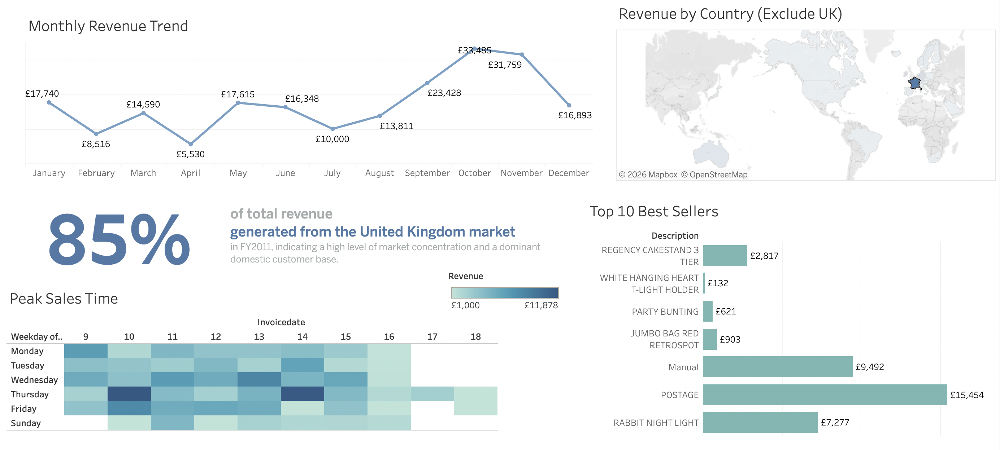

# Global Retail Sales Analysis 2011

## Interactive Dashboard
[**Click here to view the Interactive Dashboard on Tableau Public**](https://public.tableau.com/app/profile/t.n.tr.n8477/viz/Retail_Sales_17762621520820/GLOBALRETAILSALESPERFORMANCEDASHBOARD2011_?publish=yes)

## Project Overview
Dự án phân tích hơn 500,000 giao dịch bán lẻ để tìm ra xu hướng doanh thu.
- **SQL:** Làm sạch dữ liệu và xử lý các giao dịch lỗi.
- **Tableau:** Trực quan hóa dữ liệu với các chỉ số quan trọng (85% doanh thu đến từ UK).

## Preview

## Key Business Insights
Dựa trên kết quả phân tích, rút ra được các insights sau:

 **Rủi ro tập trung thị trường (Market Concentration):** Doanh thu từ Vương quốc Anh chiếm tới **85%**. Điều này cho thấy sự phụ thuộc quá lớn vào một thị trường duy nhất. 
     **Đề xuất:** Mở rộng các chiến dịch marketing sang khu vực Châu Âu (Pháp, Đức) để đa dạng hóa nguồn thu.
 **Hiệu ứng mùa vụ (Seasonality):** Doanh thu tăng vọt đáng kể vào tháng 11 (> £1.5M).
     **Đề xuất:** Doanh nghiệp nên chuẩn bị nguồn hàng và nhân sự tối đa vào quý 4 hàng năm để đáp ứng nhu cầu tăng cao này.
 **Thời điểm vàng (Peak Sales Time):** Lượng giao dịch tập trung mạnh nhất từ **10:00 AM đến 3:00 PM**.
     **Đề xuất:** Triển khai các chương trình Flash Sale hoặc tăng cường đội ngũ hỗ trợ khách hàng trực tuyến trong khung giờ này để tối ưu tỷ lệ chuyển đổi.
