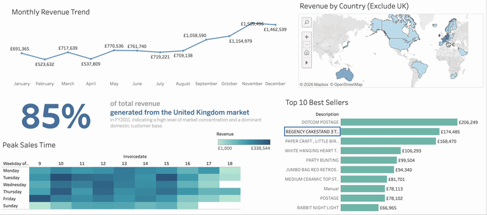

# Global Retail Sales Analysis 2011

## Interactive Dashboard
[**Bấm vào đây để xem interactive dashboard**](https://public.tableau.com/app/profile/t.n.tr.n8477/viz/Retail_Sales_17762621520820/GLOBALRETAILSALESPERFORMANCEDASHBOARD2011_?publish=yes)

## Project Overview
Dự án truy vấn và phân tích hơn 500,000 giao dịch bán lẻ để tìm ra pattern doanh thu, từ đó tìm ra pros & cons, insights & actions.
- **SQL:** Làm sạch dữ liệu và xử lý các giao dịch lỗi.
- **Tableau:** Trực quan hóa dữ liệu với các chỉ số quan trọng (85% doanh thu đến từ UK).

## SQL 
Quá trình truy vấn và làm sạch dữ liệu được thực hiện bằng SQL.
 [**Xem chi tiết các câu lệnh SQL tại đây**](./data_cleaning_steps.sql)

## Preview

## Key Business Insights
Dựa trên kết quả phân tích, rút ra được các insights sau:

### Phân Tích Key Insights
* **Rủi ro thị trường:** **85%** doanh thu tập trung tại **United Kingdom**, cho thấy sự phụ thuộc lớn vào một thị trường duy nhất.
* **Tính mùa vụ:** Doanh thu tăng vọt vào **Tháng 11** (hơn **£1.5M**), do ảnh hưởng từ xu hướng mua sắm cuối năm, các chương trình khuyến mãi Black Friday & chuẩn bị cho mùa lễ hội Halloween, Christmas.
   `Fact-check:` _Khớp với xu hướng mua sắm cuối năm toàn cầu năm 2011. Theo [PR Newswire](https://www.prnewswire.com/news-releases/global-b2c-e-commerce-market-report-2011-136250253.html), tháng 11/2011 ghi nhận mức tăng trưởng kỷ lục nhờ các sự kiện giảm giá._
* **Khung giờ vàng:** **80%** giao dịch diễn ra từ **10:00 sáng - 3:00 chiều**, đây là thời điểm khách hàng hoạt động mạnh nhất.

---
### Đề Xuất Hành Động
* **Đa dạng hóa:** Mở rộng tiếp thị sang các thị trường EU (Pháp, Đức) để giảm bớt sự phụ thuộc vào thị trường Anh.
* **Quản trị nguồn lực:** Tăng cường lượng hàng tồn kho và nhân sự hỗ trợ trong **Quý 4** để khai thác tối đa sức mua cuối năm.
* **Tối ưu quảng cáo:** Tập trung chạy các chiến dịch khuyến mãi và Flash Sale vào **Khung giờ vàng** để tối ưu hóa conversion rates.
